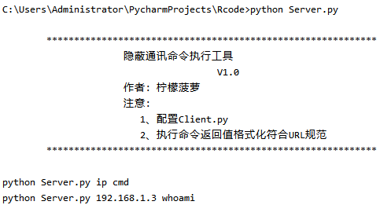
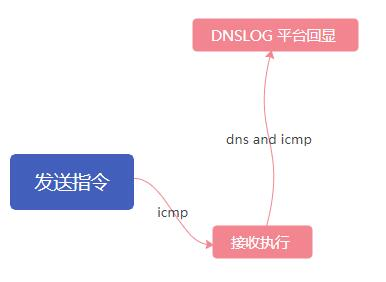
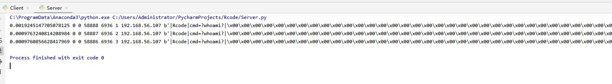
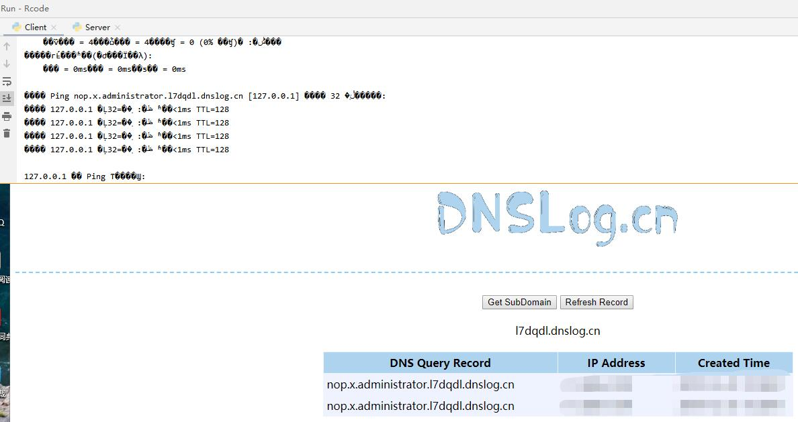

# Rcode-隐蔽通讯命令执行程序

# 测试环境
Client.py 在 windows10和kali linux 下通过测试。
Server.py 在 windows10 下通过测试。

# 使用方法

# 传递原理
+ Server --icmp--> Client --dns and icmp--> DNSLOG

# Server.py
+ 使用了 Python3 Anacinda3 集成环境。

# Client.py
+ 使用Python3 环境，需要配置监听IP和dnslog.cn个人地址。

